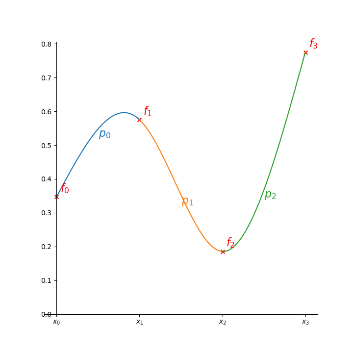

# Going Further

## Cubic splines

Cubic splines are a popular way of interpolating data.  A cubic
polynomial is fit to 2 adjacent data samples.  Consider a cubic of the form:

$$p_i(x) = a (x-x_i)^3 + b(x - x_i)^2 + c (x-x_i) + d$$

We want to fit $p_i(x)$ to the range $[x_i, x_{i+1}]$, as illustrated here:

Consider the points $(x_1, f_1)$ and $(x_2, f_2)$.
Since we need 4
parameters to fit a cubic, we use the values of the function at the
two points as well as the derivatives.  And the derivatives of the
cubic at the end point are matched to those of the next cubic spline.

At $x_1$:

* $p_0(x_1) = f_1$
* $p_1(x_1) = f_1$
* $p_0^\prime(x_1) = p_1^\prime(x_1)$
* $p_0^{\prime\prime}(x_1) = p_1^{\prime\prime}(x_1)$

and at $x_2$:

* $p_1(x_2) = f_2$
* $p_2(x_2) = f_2$
* $p_1^\prime(x_2) = p_2^\prime(x_2)$
* $p_1^{\prime\prime}(x_2) = p_2^{\prime\prime}(x_2)$

This means that all of the cubics are coupled together, and a linear
system needs to be solved for find all of the coefficients simultaneously.

