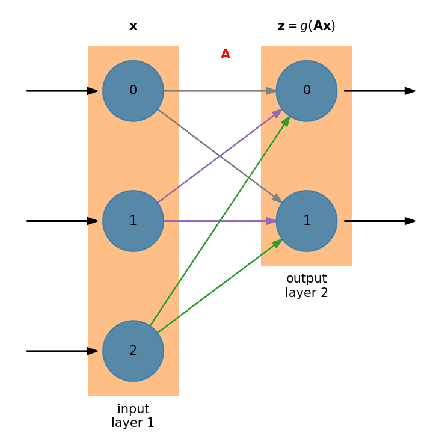

# Machine Learning Basics

## Neural networks

When we talk about machine learning, we usually mean an [_artifical
neural
network_](https://en.wikipedia.org/wiki/Artificial_neural_network).  A
neural network mimics the action of neurons in your brain.  We'll
follow the notation from _Computational Method for Physics_ by
Franklin.

Basic idea:

* Create a nonlinear fitting routine with free parameters
* Train the network on data with known inputs and outputs to set the parameters
* Use the trained network on new data to predict the outcome

We can think of a neural network as a map that takes a set of
$N_\mathrm{in}$ parameters and returns a set of $N_\mathrm{out}$
parameters, which we can express this as:

$${\bf z} = {\bf A} {\bf x}$$

where

$${\bf x} = (x_1, x_2, \ldots, x_{N_\mathrm{in}})$$

are the inputs,

$${\bf z} = (z_1, z_2, \ldots, z_{N_\mathrm{out}})$$

are the outputs, and
${\bf A}$ is an $N_\mathrm{out} \times N_\mathrm{in}$ matrix.

Our goal is to determine the matrix elements of ${\bf A}$.

## Nomenclature

We can visualize a neural network as:



* Neural networks are divided into _layers_

  * There is always an _input layer_&mdash;it doesn't do any processing.

  * There is always an _output layer_.

* Within a layer there are neurons or _nodes_.

  * For input, there will be one node for each input variable.  In this figure,
    there are 3 nodes on the input layer.

  * The output layer will have as many nodes are needed to convey the answer
    we are seeking from the network.  In this case, there are 2 nodes on the
    output layer.

* Every node in the first layer connects to every node in the next layer

  * The _weight_ associated with the _connection_ can vary&mdash;these are the matrix elements.

    ```{note}
    This is called a _dense layer_.  There are alternate types of layers
    we can explore where the nodes are connected differently.
    ```

* In this example, the processing is done in layer 2 (the output)

* When you train the neural network, you are adjusting the weights connecting to the nodes

  * Some connections might have zero weight

  * This mimics nature&mdash;a single neuron can connect to several (or lots) of other neurons.

## Universal approximation theorem

A neural network can be designed to approximate any function, $f(x)$.  For this to work, there must be a source of non-linearity in the network.  This is applyed on a layer.  This is a result of the [universal approximation theorem](https://en.wikipedia.org/wiki/Universal_approximation_theorem).

We call this an [_activation function_](https://en.wikipedia.org/wiki/Activation_function) and it has the form:


$$g({\bf v}) = \left ( \begin{array}{c} g(v_0) \\ g(v_1) \\ \vdots \\ g(v_{n-1}) \end{array} \right )$$

```{note}
The activation function, $g(\xi)$ works element-by-element.
```

Then our neural network has the form: ${\bf z} = g({\bf A x})$

We want to choose a function $g(\xi)$ that is differentiable.  A common choice is the _sigmoid function_:

$$g(\xi) = \frac{1}{1 + e^{-\xi}}$$

```{figure} sigmoid.png
---
align: center
---
The sigmoid function
```


## Basic algorithm


* Training

  * Loop over the $T$ pairs $({\bf x}^k, {\bf y}^k)$ for $k = 1, \ldots, T$

    * Predict the output for ${\bf x}^k$ as:

      $$z_i = g([{\bf A x}^k]_i) = g \left ( \sum_{j=1}^{N_\mathrm{in}} A_{ij} x^k_j \right )$$

    * Constrain that ${\bf z} = {\bf y}^k$.

      This is a minimization problem, where we are minimizing:

      \begin{align*}
      f(A_{ij}) &= \| g({\bf A x}^k) - {\bf y}^k \|^2 \\
                &= \sum_{i=1}^{N_\mathrm{out}} \left [ g\left (\sum_{j=1}^{N_\mathrm{in}} A_{ij} x^k_j \right ) - y^k_i \right ]^2
      \end{align*}

      We call this function the _cost function_.

      ```{info}
      This is one possible choice for the cost function, $f(A_{ij})$, but many others exist.
      ```

    * Update the matrix ${\bf A}$ based on the training pair $({\bf x}^k, {\bf y^{k}})$.

* Using the network

  With the trained ${\bf A}$, we can now use the network on data we haven't seen before, $\boldsymbol \chi$:

  $$z_i = g([{\bf A {\boldsymbol \chi}}^k]_i) = g \left ( \sum_{j=1}^{N_\mathrm{in}} A_{ij} \chi^k_j \right )$$

There are a lot of details that we still need to figure out involving the training and minimization.
We'll start with minimization: a common minimization technique used with
neural networks is [_gradient descent_](https://en.wikipedia.org/wiki/Gradient_descent).
