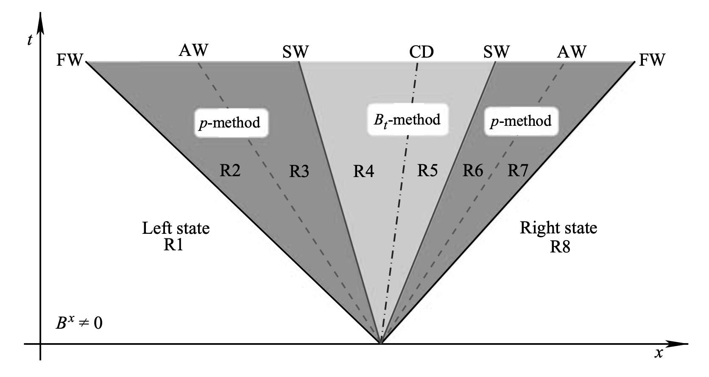

As for the Euler equations we need to compute the fluxes through the interface
and solve the Riemann problem for the MHD equations.  We use the same formulations with
left and right primitive variable states and we want to find the unique state on the interface:
    
$${\\bf q}_{i+1/2} = \\mathcal{R}({\\bf q}_{i+1/2,L}, {\\bf q}_{i+1/2,R})$$
    
Information about the jump across this interface will be carried away from the interface by now seven magnetohydrodynamic waves.  We can define eight regions separated by the seven waves.
    

    
$R1$ and $R8$ are just our original states&mdash;since no waves have reached them yet, the state is unchanged. The states in between are separated by the fast and slow magnetosonic, the Alfven waves, and the contact discontinuity.
  
# Solving the Riemann problem in MHD
  
Solving the Riemann problem in MHD exactly is much harder than for the Euler equations. You can find details about 
some of the methods used here https://pure.mpg.de/rest/items/item_150800/component/file_150799/content#:~:text=The%20general%20Riemann%20problem%20in,the%20density%20may%20be%20discontinuous.
As a result often approximative solvers are used for MHD simulations. Typical examples are the HLLE and HLLD Riemann solvers. Outside of the Riemann solvers we can use the same methods that we developed for the Euler equations to solve the MHD equations.
