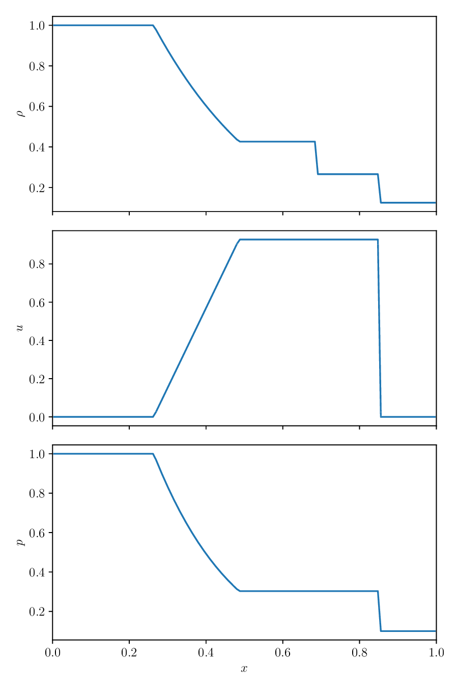

# Magnetohydrodynamics Equations

The Euler equations describe compressible flow in the absence of
dissipative effects (like viscosity). If we add magnetic fields, 
we get the equations of (ideal) magnetohydrodynamics. In 
one-dimension, they are:

$$
\begin{align*}
\frac{\partial \rho}{\partial t} + \frac{\partial (\rho u)}{\partial x} &= 0 \\
\frac{\partial (\rho u)}{\partial t} + \frac{\partial}{\partial x} (\rho u^2 + p + \frac{B^2}{2} - \vec{B} \cdot \vec{B}) &= 0 \\
\frac{\partial (\rho E)}{\partial t} + \frac{\partial}{\partial x} \left [ (\rho E + p) u - \vec{B} (\vec{u}\cdot \vec{B})\right ] &= 0 \\
\frac{\partial \vec{B}}{\partial t} + \frac{\partial (\vec{B}\vec{u} -\vec{u}\vec{B})}{\partial x} &= 0 \\
\end{align*}
$$

Here, $E$ is the specific total energy which is related to the specific internal energy as:

$$
\rho E = \rho e + \frac{1}{2} \rho u^2,
$$

$\vec{B}$ is the magnetic field vector, and the system is closed by an equation of state:

$$p = p(\rho, e)$$

A common equation of state is a *gamma-law EOS*:

$$ p = \rho e (\gamma - 1)$$

where $\gamma$ is a constant.  For an ideal gas, $\gamma$ is the ratio of specific heats, $c_p / c_v$.

## Conservative form

As expressed above, the ideal MHD equations are in conservative form.  We can define the conservative
state, ${\bf U}$ as:

$${\bf U} = \left ( \begin{array}{c} \rho \\ \rho u \\ \rho E \\ \vec{B}\end{array} \right )$$

and the flux, ${\bf F}({\bf U})$ as:

$${\bf F} = \left ( \begin{array}{c} \rho u \\ \rho u^2 + p + \frac{B^2}{2} - \vec{B} \cdot \vec{B} \\ (\rho E + p) u - \vec{B} (\vec{u}\cdot \vec{B}) \\ \vec{B}u - u\vec{B} \end{array} \right )$$

and then our system in conservative form is:

$${\bf U}_t + [{\bf F}({\bf U})]_x = 0$$

and we can do the same technique of discretizing the domain into cells
and integrating over the volume of a cell to get the finite-volume
conservative update for the system:

$$\frac{\partial {\bf U}_i}{\partial t} =
  - \frac{1}{\Delta x} \left [ {\bf F}({\bf U}_{i+1/2}) - {\bf F}({\bf U}_{i+1/2}) \right ]$$

This means that we will be able to use the same basic solution methodology
from advection and Burgers' equation with the Euler equations, so long
as we can find the fluxes.  This primarily means that we need to understand the Riemann
problem for the Euler equations.

## Primitive variable form

We can alternately express the Euler equations in terms of the primitive variables, ${\bf q}$:

$${\bf q} = \left ( \begin{array}{c} \rho \\ u \\ p \end{array} \right )$$

and the evolution equations are:

$$
\left ( \begin{array}{c} \rho \\ u \\ p \end{array} \right )_t +
   \left ( \begin{array}{c} u & \rho & 0 \\ 0 & u & 1/\rho \\ 0 & \Gamma_1 p & u \end{array} \right )
   \left ( \begin{array}{c} \rho \\ u \\ p \end{array} \right )_x = 0
$$

where $\Gamma_1 = d \log p/d \log \rho |_s$

or compactly:

$${\bf q}_t + {\bf A}({\bf q}) {\bf q}_x = 0$$

For Euler, we defined the speed of sound as:

$$c_s = \sqrt{\frac{\Gamma_1 p}{\rho}}$$

In MHD, we can also define the Alfven velocity

$$c_A = \sqrt{\frac{B}{\sqrt{\mu_0 \rho}}$$,

and the fast magnetosonic speed

$$c_f = \sqrt{v_A^2+c_s^2}$$,

## Characteristic form

In MHD we get a more complex set of Eigenvalues. In total, we have 7:
$$
\begin{align}
\lambda^{(-)} &= u - c_f \\
\lambda^{(-)} &= u - v_A \\
\lambda^{(-)} &= u - c_s \\
\lambda^{(0)} &= u \\
\lambda^{(+)} &= u + c_s \\
\lambda^{(+)} &= u + v_A \\
\lambda^{(+)} &= u + c_f \\
\end{align}
$$

These are the speeds at which information propagates in our system.

